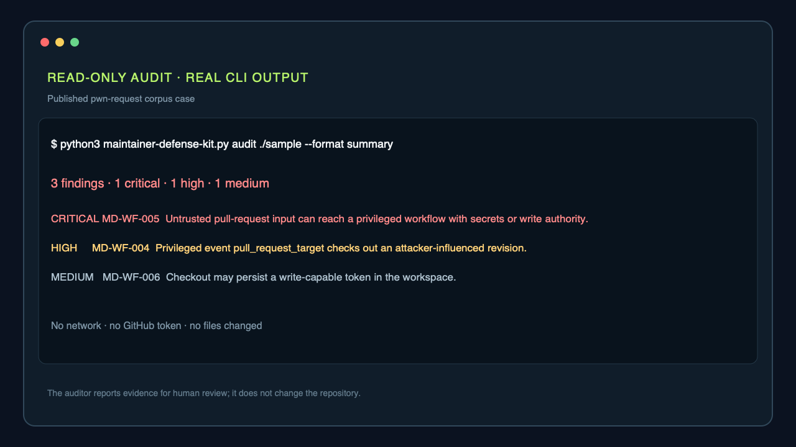

# Awesome Maintainer Defense

> リポジトリを変更せずに、危険なGitHub設定や自動処理を見つけます。

[English](README.md) · [Tiếng Việt](README.vi.md) · [日本語](README.ja.md)

[](https://github.com/thangldw/awesome-maintainer-defense/actions/workflows/quality.yml)
[](LICENSE)

**Maintainer Defense Kit**がproductです。CLI auditor、rollback可能なprofile、policy、playbookを含みます。**Awesome Maintainer Defense**は同じrepository内の根拠確認済みcommunity catalogです。**不正利用への対策であり、反AIではありません**。findingはreview入力であり、作成者や意図の証明ではありません。

## まず監査する

次は公開corpusの`pwn-request` caseから取得した実際の`--format summary` outputです。

```text
3 findings · 1 critical · 1 high · 1 medium

CRITICAL MD-WF-005  Untrusted pull-request input can reach a privileged workflow with secrets or write authority.
HIGH     MD-WF-004  Privileged event pull_request_target checks out an attacker-influenced revision.
MEDIUM   MD-WF-006  Checkout may persist a write-capable token in the workspace.
```



依存なしのv1.1 CLIを取得し、checksumを検証します。監査はnetworkやGitHub tokenを使いません。

```bash
curl -fLO https://github.com/thangldw/awesome-maintainer-defense/releases/download/v1.1/maintainer-defense-kit.py
curl -fLO https://github.com/thangldw/awesome-maintainer-defense/releases/download/v1.1/maintainer-defense-kit.py.sha256

sha256sum -c maintainer-defense-kit.py.sha256
# macOS: shasum -a 256 -c maintainer-defense-kit.py.sha256

python3 maintainer-defense-kit.py audit .
python3 maintainer-defense-kit.py audit . --format summary
python3 maintainer-defense-kit.py audit . --format sarif > maintainer-defense.sarif
python3 maintainer-defense-kit.py fix . --output recommended.patch
```

または、package managerから同じv1.1 codeを導入できます。

```bash
pipx install https://github.com/thangldw/awesome-maintainer-defense/releases/download/v1.1/maintainer_defense_kit-1.1.0-py3-none-any.whl

brew tap thangldw/maintainer-defense https://github.com/thangldw/awesome-maintainer-defense
brew install thangldw/maintainer-defense/maintainer-defense-kit
```

`fix`はunified diffだけを出力し、file、GitHub設定、commit、pushを変更しません。[rule reference](docs/AUDITOR_RULES.md)、[rule別synthetic evaluation](docs/AUDITOR_EVALUATION.md)、[公開repository pilot](docs/AUDITOR_PILOT.md)、[独立pilot program](docs/AUDITOR_PILOT_PROGRAM.md)、[read-only SARIF workflow](docs/examples/auditor-sarif.yml)を参照してください。

## Xではなく、このツールを使う理由

Repository policy fileと危険なGitHub Actions patternの両方を、tokenなし・offline・read-onlyで最初に確認し、適用せずにreview可能なpatchを提案したい場合にこのkitを選びます。次のツールは、より専門的または継続的な用途を補完します。

| ツール | 適した用途 |
| --- | --- |
| **Maintainer Defense Kit** | Governance fileとworkflow trust boundaryを横断するlocal・read-only検査 |
| [zizmor](https://github.com/zizmorcore/zizmor) | GitHub Actionsに特化した、より深い静的解析 |
| [OpenSSF Scorecard](https://github.com/ossf/scorecard) | RepositoryとGitHub上のsignalを使う、より広いsecurity-health評価 |
| [OpenSSF Allstar](https://github.com/ossf/allstar) | GitHub Appによる複数repositoryの継続的policy検査 |

これらは併用できます。どれか一つの合格結果だけでrepositoryの安全性が証明されるわけではありません。

## 防御profileを導入する

既定はpreviewです。予定されたすべての`CREATE`/`KEEP`出力先と対応するkit assetの内容を確認してから`--apply`を追加します。

```bash
python3 maintainer-defense-kit.py --target . --profile observe --language ja --repo OWNER/REPOSITORY
python3 maintainer-defense-kit.py --target . --profile observe --language ja --repo OWNER/REPOSITORY --apply
python3 maintainer-defense-kit.py --target . --verify
```

Installerは競合fileを拒否し、ownershipとhashをmanifestへ記録します。Installer所有fileが変更済みの場合はuninstallしません。


## 次の操作を選ぶ

| 状態 | 推奨操作 |
| --- | --- |
| baseline未整備 | [native controls](docs/NATIVE_CONTROLS.md)を確認してaudit |
| 通常のcontribution量 | `observe`を導入し、利用者に見える操作なしで測定 |
| 測定済みのreview overload | `balanced`を検討し、人間reviewと異議申立てを維持 |
| supply-chain risk | `hardened`でpin、token、dependency policyを確認 |
| 進行中のincident | [日本語playbook](docs/ja/PLAYBOOK.md)に従い、制限に期限を設定 |

[documentation hub](docs/README.md)からproduct reference、operations、evidence、deployable assetsへ移動できます。[Outcome roadmap](ROADMAP.md)は、project拡張前に必要な根拠を示します。

## リソース

[](https://awesome.re)

Catalogは[`catalog.json`](catalog.json)から生成され、翻訳は[`i18n/ja.json`](i18n/ja.json)で管理されます。⭐は実用的な出発点であり、順位や有料掲載ではありません。

<!-- catalog:start -->

### 不正利用の検知・モデレーション

スパム、嫌がらせ、低品質な自動コントリビューションを検知し、ラベル付け、隔離、対応します。

| リソース | 種別 | ライセンス | 主な価値 |
| --- | --- | --- | --- |
| [Niubi Guard](https://github.com/Albert-Weasker/niubi_guard) ⭐ | ツール | Apache-2.0 | スパム、嫌がらせ、協調攻撃に対応するリポジトリ不正利用の検知・対処システム。 |
| [Anti Slop](https://github.com/peakoss/anti-slop) ⭐ | GitHub Action | AGPL-3.0 | 低品質またはAI-slopのプルリクエストを検知し、必要に応じて閉じる設定可能なGitHub Action。 |
| [GitHub AI Moderator](https://github.com/github/ai-moderator) | GitHub Action | MIT | モデルを使い、スパム、リンクスパム、AI生成と推定した内容にラベルを付けるAction。 |
| [AI Community Moderator](https://github.com/benbalter/ai-community-moderator) | GitHub Action | MIT | プロジェクトのコントリビューションガイドと行動規範に基づいてコミュニティ交流をモデレート。 |
| [AI Assessment Comment Labeler](https://github.com/github/ai-assessment-comment-labeler) | GitHub Action | MIT | Issue受付時にAI評価を取得し、設定されたラベルを適用するAction。 |

### コントリビューターの信頼・参加制御

明示的な推薦や貢献履歴を利用し、プロジェクトを全面的に閉じることなく参加を制御します。

| リソース | 種別 | ライセンス | 主な価値 |
| --- | --- | --- | --- |
| [Fossier](https://github.com/PThorpe92/fossier) | ツール | MIT | 未依頼のプルリクエストスパムを減らすVouch互換のワークフローとCLI。 |
| [Vouch](https://github.com/mitchellh/vouch) ⭐ | ツール | MIT | 明示的な推薦を受けた人だけが参加できるコミュニティ信頼管理。 |
| [Good Egg](https://github.com/2ndSetAI/good-egg) | GitHub Action | MIT | GitHub全体の貢献履歴を用いてプルリクエスト作成者をスコアリング。 |

### 受付・トリアージ

構造化された受付、ラベル、ライフサイクル自動化、緊急ロックダウンによってレビュー負荷を減らします。

| リソース | 種別 | ライセンス | 主な価値 |
| --- | --- | --- | --- |
| [Labeler](https://github.com/actions/labeler) | GitHub Action | MIT | 変更ファイルやブランチパターンに基づきプルリクエストへラベルを付ける公式Action。 |
| [Stale](https://github.com/actions/stale) | GitHub Action | MIT | 長期間動きのないIssueやプルリクエストをマークし、任意で閉じる公式Action。 |
| [Lock Threads](https://github.com/dessant/lock-threads) | GitHub Action | MIT | 設定期間後に、閉じたIssue、プルリクエスト、Discussionをロック。 |
| [Repo Lockdown](https://github.com/dessant/repo-lockdown) ⭐ | GitHub Action | MIT | 新しいIssueやプルリクエストを即時に閉じてロックする緊急用Action。 |
| [Issue Metrics](https://github.com/github-community-projects/issue-metrics) | GitHub Action | MIT | Issue、プルリクエスト、Discussionの応答時間を計測してMarkdownレポートを生成。 |

### リポジトリ統制・アクセス管理

複数プロジェクトのセキュリティポリシー、ブランチ保護、リポジトリ設定を一貫させます。

| リソース | 種別 | ライセンス | 主な価値 |
| --- | --- | --- | --- |
| [OpenSSF Allstar](https://github.com/ossf/allstar) ⭐ | GitHub App | Apache-2.0 | GitHub Organization全体のセキュリティポリシーを継続的に検査・適用。 |
| [Safe Settings](https://github.com/github-community-projects/safe-settings) ⭐ | GitHub App | ISC | リポジトリ設定、ブランチ保護、チームを一元管理し、プルリクエストではdry-runを実施。 |
| [Repository Settings App](https://github.com/repository-settings/app) | GitHub App | ISC | バージョン管理された`.github/settings.yml`からリポジトリ設定を同期。 |

### ワークフロー・サプライチェーン防御

CI、依存関係、シークレット、マージ経路を悪意ある、または侵害されたコントリビューションから守ります。

| リソース | 種別 | ライセンス | 主な価値 |
| --- | --- | --- | --- |
| [Harden-Runner](https://github.com/step-security/harden-runner) ⭐ | GitHub Action | Apache-2.0 | GitHub-hosted runner上のネットワーク送信、ファイル整合性、プロセス活動を監視。 |
| [OpenSSF Scorecard](https://github.com/ossf/scorecard) ⭐ | ツール | Apache-2.0 | オープンソースプロジェクトと依存関係のセキュリティ状態を自動評価。 |
| [zizmor](https://github.com/zizmorcore/zizmor) ⭐ | ツール | MIT | GitHub Actionsワークフローのセキュリティと正当性の問題を静的解析。 |
| [pinact](https://github.com/suzuki-shunsuke/pinact) | ツール | MIT | GitHub Actionと再利用可能ワークフローを不変のコミットハッシュに固定。 |
| [Dependency Review Action](https://github.com/actions/dependency-review-action) ⭐ | GitHub Action | MIT | 脆弱な依存関係や許可されていないライセンスを追加するプルリクエストをブロック。 |
| [TruffleHog](https://github.com/trufflesecurity/trufflehog) | ツール | AGPL-3.0 | 漏えいした認証情報を発見・検証し、インシデント化する前に対処を支援。 |
| [PRevent](https://github.com/apiiro/PRevent) | GitHub App | MIT | 悪意あるコードを示す可能性のある不審なプルリクエスト変更を検知。 |
| [OSV-Scanner](https://github.com/google/osv-scanner) ⭐ | ツール | Apache-2.0 | ロックファイル、SBOM、ソース成果物をOSV脆弱性データベースでスキャン。 |
| [Gitleaks](https://github.com/gitleaks/gitleaks) ⭐ | ツール | MIT | Git履歴、ディレクトリ、ファイル、標準入力からシークレットを検知。 |

### ポリシー・プレイブック

問題が起きる前に期待事項を定め、発生時に一貫して対応します。

| リソース | 種別 | ライセンス | 主な価値 |
| --- | --- | --- | --- |
| [Open Source AI Contribution Policies](https://github.com/melissawm/open-source-ai-contribution-policies) ⭐ | リスト | CC0-1.0 | 各オープンソースプロジェクトのAI生成コントリビューション方針を比較するカタログ。 |
| [OpenSSF AI-Slop Best-Practices Work Item](https://github.com/ossf/wg-vulnerability-disclosures/issues/178) | ワーキンググループ | N/A | 低品質なAIセキュリティ報告とコントリビューションの実務指針を検討中の作業項目。完成した標準ではありません。 |

<!-- catalog:end -->

## 安全契約

- 作成者を推測せず、品質とrepository riskを評価します。
- 未信頼codeをsecretやwrite token付きで実行しません。
- 観察から始め、根拠がある場合だけ執行します。
- 自動closeやlockより先にqueueとstatus checkを使います。
- rule、owner、review date、rollback、異議申立て経路を公開します。
- scanner resultやcatalog listingをsecurity certificationとして扱いません。

production利用前に[日本語保証ケース](docs/ja/KIT_ASSURANCE.md)を確認してください。Templateは法的助言ではありません。本プロジェクトは[MIT License](LICENSE)です。
