# Awesome Maintainer Defense

[English](#english) · [Tiếng Việt](#tiếng-việt) · [日本語](#日本語)

Offline repository-governance and GitHub Actions risk auditor with reversible defense profiles and an evidence-reviewed resource catalog.

```mermaid
%%{init: {"theme":"base","themeVariables":{"background":"#FFFFFF","fontFamily":"Arial, sans-serif","lineColor":"#667085","primaryTextColor":"#172B4D"}}}%%
flowchart LR
    R["Repository<br/>Repo / リポジトリ"]:::yellow
    A["Read-only audit<br/>Chỉ đọc / 読取監査"]:::blue
    F["Evidence findings<br/>Phát hiện / 所見"]:::pink
    P["Reviewable patch<br/>Patch / パッチ"]:::purple
    H["Human decision<br/>Con người / 人の判断"]:::green
    R --> A --> F --> P --> H
    classDef yellow fill:#FFF4A3,stroke:#C9A227,stroke-width:2px,color:#172B4D
    classDef blue fill:#D9EAFD,stroke:#4C78A8,stroke-width:2px,color:#172B4D
    classDef pink fill:#FFE1E6,stroke:#C96A7B,stroke-width:2px,color:#172B4D
    classDef purple fill:#E9DDF7,stroke:#8064A2,stroke-width:2px,color:#172B4D
    classDef green fill:#DDF5E3,stroke:#4F9D69,stroke-width:2px,color:#172B4D
```



## English

The dependency-free Python CLI audits repository policy and workflow trust boundaries without a network connection or GitHub token. `fix` emits a unified diff; it never edits a repository, changes settings, commits or pushes. Findings are review inputs, not proof of authorship, intent or safety.

<!-- auditor-output:start -->
```text
3 findings · 1 critical · 1 high · 1 medium

CRITICAL MD-WF-005  Untrusted pull-request input can reach a privileged workflow with secrets or write authority.
HIGH     MD-WF-004  Privileged event pull_request_target checks out an attacker-influenced revision.
MEDIUM   MD-WF-006  Checkout may persist a write-capable token in the workspace.
```
<!-- auditor-output:end -->

```bash
python3 scripts/build_standalone.py
python3 dist/maintainer-defense-kit.py audit .
python3 dist/maintainer-defense-kit.py fix . --output recommended.patch
python3 scripts/validate.py
python3 scripts/test_auditor.py
```

## Tiếng Việt

CLI Python không dependency kiểm tra policy và ranh giới tin cậy của workflow mà không cần mạng hoặc GitHub token. Lệnh `fix` chỉ tạo unified diff; không sửa repo, đổi setting, commit hoặc push. Mỗi finding chỉ là bằng chứng cần con người xem xét, không phải kết luận về tác giả, ý định hay mức độ an toàn.

## 日本語

依存関係のない Python CLI は、ネットワークや GitHub トークンなしでリポジトリ方針とワークフローの信頼境界を監査します。`fix` は unified diff を出力するだけで、ファイル編集、設定変更、commit、push は行いません。所見は人が確認するための根拠であり、作者、意図、安全性の証明ではありません。

The deployable kit keeps example `.github` directories because those files are product assets; they do not execute in this repository.

The repository is also a local, skills-only plugin for ChatGPT, Codex, Claude Code and Cowork. It does not require a hosted connector. See the [directory submission package](docs/SUBMISSION.md), [privacy policy](PRIVACY.md), [terms](TERMS.md), and [support guidance](SUPPORT.md).

## Evidence-reviewed catalog

<!-- catalog:start -->

### Abuse Detection & Moderation

Detect, label, quarantine, or respond to spam, harassment, and low-quality automated contributions.

| Resource | Type | License | Why it matters |
| --- | --- | --- | --- |
| [Niubi Guard](https://github.com/Albert-Weasker/niubi_guard) ⭐ | tool | Apache-2.0 | Repository abuse detection and response system for spam, harassment, and coordinated attacks. |
| [Anti Slop](https://github.com/peakoss/anti-slop) ⭐ | github-action | AGPL-3.0 | Configurable GitHub Action that detects and can close low-quality or AI-slop pull requests. |
| [GitHub AI Moderator](https://github.com/github/ai-moderator) | github-action | MIT | Model-powered Action that labels spam, link spam, and content it infers to be AI-generated. |
| [AI Community Moderator](https://github.com/benbalter/ai-community-moderator) | github-action | MIT | Moderates community interactions against a project's contributing guide and code of conduct. |
| [AI Assessment Comment Labeler](https://github.com/github/ai-assessment-comment-labeler) | github-action | MIT | Issue-intake Action that retrieves an AI assessment and applies configurable labels. |

### Contributor Trust & Admission

Use explicit vouches or contribution history to control access without closing a project to everyone.

| Resource | Type | License | Why it matters |
| --- | --- | --- | --- |
| [Fossier](https://github.com/PThorpe92/fossier) | tool | MIT | Vouch-compatible workflow and CLI for reducing unsolicited pull-request spam. |
| [Vouch](https://github.com/mitchellh/vouch) ⭐ | tool | MIT | Community trust management based on explicit vouches before a participant can contribute. |
| [Good Egg](https://github.com/2ndSetAI/good-egg) | github-action | MIT | Scores pull-request authors using their contribution history across GitHub. |

### Intake & Triage

Reduce review load with structured intake, labels, lifecycle automation, and emergency lockdowns.

| Resource | Type | License | Why it matters |
| --- | --- | --- | --- |
| [Labeler](https://github.com/actions/labeler) | github-action | MIT | Official Action for labeling pull requests from changed files and branch patterns. |
| [Stale](https://github.com/actions/stale) | github-action | MIT | Official Action for marking and optionally closing inactive issues and pull requests. |
| [Lock Threads](https://github.com/dessant/lock-threads) | github-action | MIT | Locks closed issues, pull requests, and discussions after a configurable period. |
| [Repo Lockdown](https://github.com/dessant/repo-lockdown) ⭐ | github-action | MIT | Emergency Action that immediately closes and locks new issues or pull requests. |
| [Issue Metrics](https://github.com/github-community-projects/issue-metrics) | github-action | MIT | Measures issue, pull-request, and discussion response times and generates a Markdown report. |

### Repository Governance & Access

Keep security policies, branch protections, and repository settings consistent across projects.

| Resource | Type | License | Why it matters |
| --- | --- | --- | --- |
| [OpenSSF Allstar](https://github.com/ossf/allstar) ⭐ | github-app | Apache-2.0 | Continuously checks and enforces security policies across GitHub organizations. |
| [Safe Settings](https://github.com/github-community-projects/safe-settings) ⭐ | github-app | ISC | Centrally manages repository settings, branch protections, and teams with pull-request dry runs. |
| [Repository Settings App](https://github.com/repository-settings/app) | github-app | ISC | Synchronizes repository settings from a version-controlled `.github/settings.yml` file. |

### Workflow & Supply-Chain Defense

Protect CI, dependencies, secrets, and merge paths from hostile or compromised contributions.

| Resource | Type | License | Why it matters |
| --- | --- | --- | --- |
| [Harden-Runner](https://github.com/step-security/harden-runner) ⭐ | github-action | Apache-2.0 | Monitors network egress, file integrity, and processes on GitHub-hosted runners. |
| [OpenSSF Scorecard](https://github.com/ossf/scorecard) ⭐ | tool | Apache-2.0 | Automated security-health checks for open-source projects and their dependencies. |
| [zizmor](https://github.com/zizmorcore/zizmor) ⭐ | tool | MIT | Static analysis for security and correctness problems in GitHub Actions workflows. |
| [pinact](https://github.com/suzuki-shunsuke/pinact) | tool | MIT | Pins GitHub Actions and reusable workflows to immutable commit hashes. |
| [Dependency Review Action](https://github.com/actions/dependency-review-action) ⭐ | github-action | MIT | Blocks pull requests that introduce vulnerable dependencies or disallowed licenses. |
| [TruffleHog](https://github.com/trufflesecurity/trufflehog) | tool | AGPL-3.0 | Finds and verifies leaked credentials before they become a maintainer incident. |
| [PRevent](https://github.com/apiiro/PRevent) | github-app | MIT | Detects suspicious pull-request changes that may indicate malicious code. |
| [OSV-Scanner](https://github.com/google/osv-scanner) ⭐ | tool | Apache-2.0 | Scans lockfiles, SBOMs, and source artifacts against the OSV vulnerability database. |
| [Gitleaks](https://github.com/gitleaks/gitleaks) ⭐ | tool | MIT | Detects secrets in Git history, directories, files, and standard input. |

### Policies & Playbooks

Set expectations before problems arrive and respond consistently when they do.

| Resource | Type | License | Why it matters |
| --- | --- | --- | --- |
| [Open Source AI Contribution Policies](https://github.com/melissawm/open-source-ai-contribution-policies) ⭐ | awesome-list | CC0-1.0 | Comparative catalog of how open-source projects govern AI-generated contributions. |
| [OpenSSF AI-Slop Best-Practices Work Item](https://github.com/ossf/wg-vulnerability-disclosures/issues/178) | working-group | N/A | Open work item developing practices for low-quality AI security reports and contributions; not a finalized standard. |

<!-- catalog:end -->

Released under the [MIT License](LICENSE). Separate Vietnamese and Japanese catalog views remain in [README.vi.md](README.vi.md) and [README.ja.md](README.ja.md).
