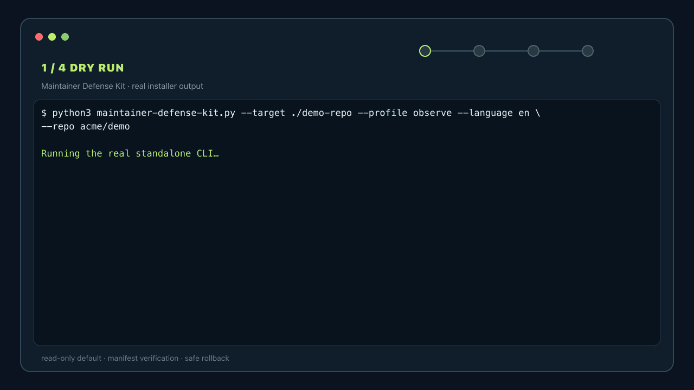

# Awesome Maintainer Defense

> Biện pháp chỉ đọc, có thể đảo ngược cho maintainer OSS—công cụ đã audit, workflow và CLI độc lập dùng thử trong 60 giây.

[English](README.md) · [Tiếng Việt](README.vi.md) · [日本語](README.ja.md)

[](https://awesome.re)
[](https://github.com/thangldw/awesome-maintainer-defense/actions/workflows/quality.yml)
[](LICENSE)

Mã nguồn mở nên tiếp tục cởi mở nhưng maintainer không phải hấp thụ vô hạn spam, quấy rối, workflow không an toàn, contribution tự động chất lượng thấp hay báo cáo bảo mật nhiễu. Repo này tuyển chọn các biện pháp thực tế, đồng thời giữ human review và cơ hội cho contributor mới.

Dự án này **chống lạm dụng, không chống AI**. Chúng tôi ưu tiên tín hiệu minh bạch, hành động có thể đảo ngược, quyền tối thiểu và cơ chế khiếu nại rõ ràng; không xem công cụ nào là bằng chứng tuyệt đối về việc nội dung do AI tạo.

## Thử trong 60 giây

Không cần signup, clone repo hay tin một package manager. Tải trực tiếp CLI v1.0.1 độc lập từ GitHub Releases, kiểm tra checksum, xem trước profile `observe` chỉ đọc rồi chỉ cài khi diff phù hợp. Yêu cầu Python 3.10+. Lệnh tải không bao giờ được pipe vào shell:

```bash
curl -fLO https://github.com/thangldw/awesome-maintainer-defense/releases/download/v1.0.1/maintainer-defense-kit.py
curl -fLO https://github.com/thangldw/awesome-maintainer-defense/releases/download/v1.0.1/maintainer-defense-kit.py.sha256

sha256sum -c maintainer-defense-kit.py.sha256
# macOS: shasum -a 256 -c maintainer-defense-kit.py.sha256

python3 maintainer-defense-kit.py --target . --profile observe --language vi --repo OWNER/REPOSITORY
python3 maintainer-defense-kit.py --target . --profile observe --language vi --repo OWNER/REPOSITORY --apply
```

CLI là một file Python không có dependency, chứa 25 asset đã khóa theo phiên bản; nó không gọi mạng hay GitHub API. Sau khi cài, chạy `python3 maintainer-defense-kit.py --target . --verify`; dùng `--uninstall` để rollback có kiểm soát.



[Kit có thể cài đặt](kits/maintainer-defense-kit/README.vi.md) gồm ba profile `observe`, `balanced`, `hardened`, uninstall an toàn và asset triển khai đầy đủ về cấu trúc bằng tiếng Anh, Việt, Nhật; nội dung Việt/Nhật chưa được chuyên gia bảo mật/pháp lý bản ngữ review độc lập. [Hợp đồng signal](docs/PROFILE_SIGNALS.md) công bố toàn bộ threshold và proxy bị tắt. [Hồ sơ đảm bảo](docs/vi/KIT_ASSURANCE.md) nói rõ phần nào đã được test kỹ thuật và phần hiệu quả thực tế nào chưa có dữ liệu hiện trường. Xem [changelog v1.0.1](CHANGELOG.md) để theo dõi sửa đổi audit mới nhất.

## Bắt đầu nhanh

| Tình huống | Bước đầu tiên | Sau đó cân nhắc |
| --- | --- | --- |
| Dự án bình thường, ít thời gian | Cài profile `observe` chỉ đọc | Đo false positive trước khi cân nhắc `balanced` |
| Issue hoặc PR tăng đột biến | Tắt auto-merge và bật interaction limit tạm thời | Chỉ dùng lockdown khi có owner và thời hạn |
| PR chất lượng thấp lặp lại | Gắn nhãn để người thật review trước khi tự động đóng | Chạy công cụ ở dry-run và công bố policy |
| Quấy rối hoặc tấn công phối hợp | Lưu bằng chứng và giới hạn tương tác | Báo cáo lạm dụng, tránh khuếch đại nội dung |
| Thay đổi workflow đáng ngờ | Không chạy code không tin cậy với write token | Chạy zizmor, ghim Action và giảm quyền token |

Xem [native control nên ưu tiên](docs/NATIVE_CONTROLS.md), rồi đọc [audit tài nguyên](docs/RESOURCE_AUDIT.md), [phương pháp đánh giá](docs/EVALUATION.md), [threat model](docs/THREAT_MODEL.md) và [playbook tiếng Việt](docs/vi/PLAYBOOK.md) trước khi áp dụng.

## Nguyên tắc

1. **Đánh giá chất lượng, không đoán tác giả.** Xem reproduction, phạm vi, test và khả năng phản hồi.
2. **Review trước khi thực thi.** Bắt đầu bằng dry-run hoặc report-only và đo false positive.
3. **Quyền tối thiểu.** Không để workflow đặc quyền chạy code từ pull request không tin cậy.
4. **Có thể đảo ngược.** Ưu tiên nhãn và queue trước close, lock hoặc block.
5. **Công bố luật chơi.** Contributor cần biết policy, chuẩn bằng chứng và đường khiếu nại.
6. **Bảo vệ sự chú ý của maintainer.** Dự án có quyền từ chối công việc tạo chi phí review lớn hơn giá trị.

## Tài nguyên

⭐ là điểm bắt đầu được đề xuất, không phải vị trí trả phí. Bảng được sinh từ [`catalog.json`](catalog.json); dữ liệu dịch nằm trong [`i18n/vi.json`](i18n/vi.json).

<!-- catalog:start -->

### Phát hiện lạm dụng & kiểm duyệt

Phát hiện, gắn nhãn, cách ly hoặc xử lý spam, quấy rối và contribution tự động chất lượng thấp.

| Tài nguyên | Loại | Giấy phép | Giá trị chính |
| --- | --- | --- | --- |
| [Niubi Guard](https://github.com/Albert-Weasker/niubi_guard) ⭐ | công cụ | Apache-2.0 | Hệ thống phát hiện và xử lý lạm dụng repository, bao gồm spam, quấy rối và tấn công phối hợp. |
| [Anti Slop](https://github.com/peakoss/anti-slop) ⭐ | GitHub Action | AGPL-3.0 | GitHub Action có thể cấu hình để phát hiện và đóng pull request chất lượng thấp hoặc AI-slop. |
| [GitHub AI Moderator](https://github.com/github/ai-moderator) | GitHub Action | MIT | Action dùng model để gắn nhãn spam, link spam và nội dung mà model suy đoán do AI tạo. |
| [AI Community Moderator](https://github.com/benbalter/ai-community-moderator) | GitHub Action | MIT | Kiểm duyệt tương tác cộng đồng dựa trên hướng dẫn contribution và code of conduct của dự án. |
| [AI Assessment Comment Labeler](https://github.com/github/ai-assessment-comment-labeler) | GitHub Action | MIT | Action tiếp nhận issue, lấy đánh giá từ AI và áp dụng các nhãn có thể cấu hình. |

### Niềm tin contributor & kiểm soát gia nhập

Dùng vouch công khai hoặc lịch sử contribution để kiểm soát quyền tham gia mà không đóng cửa dự án với tất cả mọi người.

| Tài nguyên | Loại | Giấy phép | Giá trị chính |
| --- | --- | --- | --- |
| [Fossier](https://github.com/PThorpe92/fossier) | công cụ | MIT | Workflow và CLI tương thích với Vouch để giảm spam pull request không được yêu cầu. |
| [Vouch](https://github.com/mitchellh/vouch) ⭐ | công cụ | MIT | Quản lý niềm tin cộng đồng bằng vouch công khai trước khi một người được phép tham gia. |
| [Good Egg](https://github.com/2ndSetAI/good-egg) | GitHub Action | MIT | Chấm điểm tác giả pull request dựa trên lịch sử contribution của họ trên GitHub. |

### Tiếp nhận & phân loại

Giảm tải review bằng biểu mẫu có cấu trúc, nhãn, tự động hóa vòng đời và cơ chế lockdown khẩn cấp.

| Tài nguyên | Loại | Giấy phép | Giá trị chính |
| --- | --- | --- | --- |
| [Labeler](https://github.com/actions/labeler) | GitHub Action | MIT | Action chính thức để gắn nhãn pull request theo file thay đổi và mẫu tên branch. |
| [Stale](https://github.com/actions/stale) | GitHub Action | MIT | Action chính thức để đánh dấu và tùy chọn đóng issue hoặc pull request không còn hoạt động. |
| [Lock Threads](https://github.com/dessant/lock-threads) | GitHub Action | MIT | Khóa issue, pull request và discussion đã đóng sau một khoảng thời gian có thể cấu hình. |
| [Repo Lockdown](https://github.com/dessant/repo-lockdown) ⭐ | GitHub Action | MIT | Action khẩn cấp đóng và khóa ngay issue hoặc pull request mới. |
| [Issue Metrics](https://github.com/github-community-projects/issue-metrics) | GitHub Action | MIT | Đo thời gian phản hồi của issue, pull request và discussion rồi tạo báo cáo Markdown. |

### Quản trị repository & quyền truy cập

Giữ chính sách bảo mật, branch protection và thiết lập repository nhất quán giữa nhiều dự án.

| Tài nguyên | Loại | Giấy phép | Giá trị chính |
| --- | --- | --- | --- |
| [OpenSSF Allstar](https://github.com/ossf/allstar) ⭐ | GitHub App | Apache-2.0 | Liên tục kiểm tra và thực thi chính sách bảo mật trên các GitHub organization. |
| [Safe Settings](https://github.com/github-community-projects/safe-settings) ⭐ | GitHub App | ISC | Quản lý tập trung thiết lập repository, branch protection và team, có dry-run cho pull request. |
| [Repository Settings App](https://github.com/repository-settings/app) | GitHub App | ISC | Đồng bộ thiết lập repository từ file `.github/settings.yml` được quản lý bằng version control. |

### Bảo vệ workflow & chuỗi cung ứng

Bảo vệ CI, dependency, secret và đường merge khỏi contribution độc hại hoặc bị xâm nhập.

| Tài nguyên | Loại | Giấy phép | Giá trị chính |
| --- | --- | --- | --- |
| [Harden-Runner](https://github.com/step-security/harden-runner) ⭐ | GitHub Action | Apache-2.0 | Theo dõi network egress, tính toàn vẹn file và tiến trình trên GitHub-hosted runner. |
| [OpenSSF Scorecard](https://github.com/ossf/scorecard) ⭐ | công cụ | Apache-2.0 | Kiểm tra tự động tình trạng bảo mật của dự án mã nguồn mở và dependency. |
| [zizmor](https://github.com/zizmorcore/zizmor) ⭐ | công cụ | MIT | Phân tích tĩnh các vấn đề bảo mật và tính đúng đắn trong GitHub Actions workflow. |
| [pinact](https://github.com/suzuki-shunsuke/pinact) | công cụ | MIT | Ghim GitHub Action và reusable workflow vào commit hash bất biến. |
| [Dependency Review Action](https://github.com/actions/dependency-review-action) ⭐ | GitHub Action | MIT | Chặn pull request đưa vào dependency có lỗ hổng hoặc giấy phép không được phép. |
| [TruffleHog](https://github.com/trufflesecurity/trufflehog) | công cụ | AGPL-3.0 | Tìm và xác minh credential bị lộ trước khi trở thành sự cố cho maintainer. |
| [PRevent](https://github.com/apiiro/PRevent) | GitHub App | MIT | Phát hiện thay đổi pull request đáng ngờ có thể cho thấy mã độc. |
| [OSV-Scanner](https://github.com/google/osv-scanner) ⭐ | công cụ | Apache-2.0 | Quét lockfile, SBOM và source artifact bằng cơ sở dữ liệu lỗ hổng OSV. |
| [Gitleaks](https://github.com/gitleaks/gitleaks) ⭐ | công cụ | MIT | Phát hiện secret trong lịch sử Git, thư mục, file và standard input. |

### Chính sách & playbook

Đặt kỳ vọng trước khi có sự cố và phản ứng nhất quán khi sự cố xảy ra.

| Tài nguyên | Loại | Giấy phép | Giá trị chính |
| --- | --- | --- | --- |
| [Open Source AI Contribution Policies](https://github.com/melissawm/open-source-ai-contribution-policies) ⭐ | danh sách | CC0-1.0 | Catalog so sánh cách các dự án mã nguồn mở quản lý contribution do AI tạo. |
| [OpenSSF AI-Slop Best-Practices Work Item](https://github.com/ossf/wg-vulnerability-disclosures/issues/178) | nhóm làm việc | N/A | Work item đang mở để xây dựng thực hành cho báo cáo bảo mật và contribution AI chất lượng thấp; chưa phải tiêu chuẩn hoàn chỉnh. |

<!-- catalog:end -->

## Tài liệu và cấu hình dùng ngay

- [Maintainer Defense Kit có thể cài đặt](kits/maintainer-defense-kit/README.vi.md) — profile đã test, manifest để xác minh, rollback an toàn và asset đầy đủ về cấu trúc bằng ba ngôn ngữ.
- [Balanced starter kit](kits/balanced) — PR template, issue form và workflow triage theo hướng review-first.
- [Workflow-hardening starter kit](kits/workflow-hardening) — dependency review và phân tích GitHub Actions đã ghim commit SHA.
- [Policy contribution có AI hỗ trợ](policies/AI_CONTRIBUTIONS.vi.md).
- [Policy cho pull request không được yêu cầu](policies/UNSOLICITED_PULL_REQUESTS.vi.md).
- [Playbook vận hành tiếng Việt](docs/vi/PLAYBOOK.md).
- [Mô hình trưởng thành](docs/MATURITY_MODEL.md) và [phương pháp đánh giá](docs/EVALUATION.md).
- [Hồ sơ đảm bảo của kit](docs/vi/KIT_ASSURANCE.md) và [native-control baseline](docs/NATIVE_CONTROLS.md).
- [Hợp đồng signal PR](docs/PROFILE_SIGNALS.md) — check, threshold, proxy bị tắt, exemption và tác động của từng profile.
- [Audit log](docs/AUDIT_LOG.md) — các sửa đổi quan trọng và entry đã bị loại.

Các template là điểm khởi đầu, không phải tư vấn pháp lý. Hãy thử trong repository không quan trọng, đọc quyền truy cập và kiểm tra data flow trước khi bật chế độ thực thi.

## Giấy phép

Dự án sử dụng [MIT License](LICENSE).
