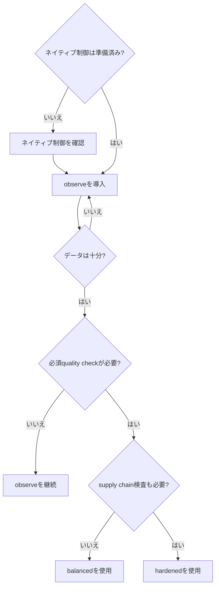

# Maintainer Defense Kit

[English](README.md) · [Tiếng Việt](README.vi.md) · [日本語](README.ja.md)

AI作成の判定を主張せず、メンテナーのレビュー負荷を減らす、導入・ロールバック可能なベースラインです。インストーラーは既定でdry-runとなり、内容が異なる既存ファイルを上書きせず、各ファイルのハッシュを記録して検証と安全な削除を行えます。

## プロファイル

| プロファイル | トークン権限 | 効果 |
| --- | --- | --- |
| `observe`（既定） | 読み取り専用 | job summaryのみ。シグナルと誤検知を測定 |
| `balanced` | 読み取り専用 | 名前付きquality status checkを失敗させる。コメント、ラベル、close、lockなし |
| `hardened` | 読み取り専用 | `balanced`に依存関係レビューとワークフロー静的解析を追加 |

すべてのプロファイルは、`en`、`vi`、`ja`の構造的に完全なIssueフォーム、PRテンプレート、ポリシー、プレイブック、ラベル仕様、導入記録をインストールします。ベトナム語・日本語表現の母語セキュリティ・法務専門家による独立レビューは未完了です。

## プロファイルの選択



## 安全な導入

Python 3.10以降が必要です。CIはLinux（3.10、3.12、3.14）とmacOS（3.12）で検証します。このリポジトリから実行し、最初のコマンドはプレビューのみです。

```bash
python3 scripts/install_kit.py --target /path/to/project --profile observe --language ja --repo OWNER/REPOSITORY
python3 scripts/install_kit.py --target /path/to/project --profile observe --language ja --repo OWNER/REPOSITORY --apply
python3 scripts/install_kit.py --target /path/to/project --verify
```

特権的な`pull_request_target`設計は、zizmorが危険なtrust boundaryを検出したため削除しました。`balanced`は読み取り専用の`pull_request`を使い、制御された`result`出力を`PR quality gate` status checkに変換します。十分に測定した後だけ、GitHubのネイティブrulesetでこのcheckをrequiredにしてください。同梱ラベル仕様は手動triage用で、前提条件ではありません。

## ロールバック

```bash
python3 scripts/install_kit.py --target /path/to/project --uninstall
```

アンインストールはインストーラーが作成したファイルだけを削除し、変更済みなら停止します。インストーラーはGitHub APIの呼び出し、ラベル作成、設定変更、コミットを行いません。Actionはcommit SHAで固定され、[`pins.json`](../../pins.json)で追跡されます。

これは技術的にテストされたベースラインであり、セキュリティ認証ではありません。[PR品質シグナル契約](../../docs/PROFILE_SIGNALS.md)と[保証ケース](../../docs/ja/KIT_ASSURANCE.md)に、保証済みの範囲と実地証拠がない範囲を記載しています。
