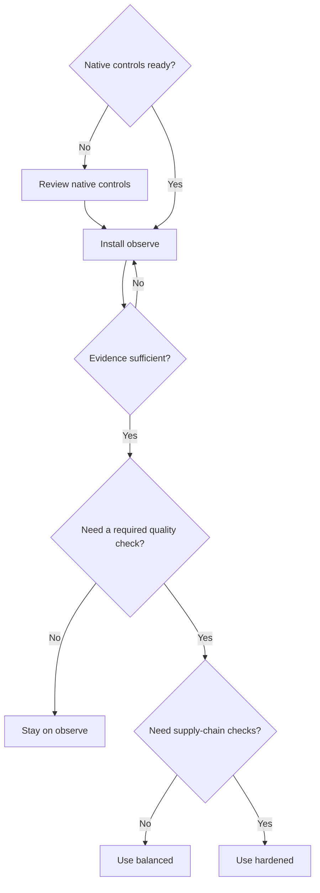

# Maintainer Defense Kit

[English](README.md) · [Tiếng Việt](README.vi.md) · [日本語](README.ja.md)

An installable, reversible baseline for reducing maintainer review load without claiming to detect AI authorship. The installer defaults to a dry run, never overwrites a conflicting file, records every installed file, and can verify or safely remove its own changes.

## Profiles

| Profile | GitHub token | Repository effect | Intended use |
| --- | --- | --- | --- |
| `observe` (default) | read-only | Job summary only | Measure signals and false positives before changing contributor-visible state. |
| `balanced` | read-only | Fails a named quality status check; no comment, label, close, or lock | Optional ruleset gate after an observation period. |
| `hardened` | read-only | Balanced gate plus dependency review and workflow static analysis | Repositories with dependency or Actions supply-chain exposure. |

All profiles also install a structured bug form, PR template, contribution policies, an operations playbook, a label specification, and an adoption record. English (`en`), Vietnamese (`vi`), and Japanese (`ja`) have structurally complete deployment assets—not README-only translations. Vietnamese and Japanese wording has not yet received independent native security/legal review.

## Choose a profile



## Install safely

Python 3.10+ is required and tested on Linux (3.10, 3.12, 3.14) and macOS (3.12). Run these commands from this repository. The first command only previews changes:

```bash
python3 scripts/install_kit.py --target /path/to/project --profile observe --language en --repo OWNER/REPOSITORY
python3 scripts/install_kit.py --target /path/to/project --profile observe --language en --repo OWNER/REPOSITORY --apply
python3 scripts/install_kit.py --target /path/to/project --verify
```

After an observation period, switch profiles by uninstalling the current profile and installing another. The write-enabled `pull_request_target` design was removed after zizmor flagged its privileged trust boundary. `balanced` now uses `pull_request` with read-only permissions and turns the Action's controlled `result` output into a named status check. If measured performance is acceptable, a maintainer may make `PR quality gate` required in a native GitHub ruleset. The included label specification is optional and manual only.

## Roll back

```bash
python3 scripts/install_kit.py --target /path/to/project --uninstall
```

Uninstall removes only files that this installer created. It refuses to proceed if an installed file was modified, so local edits cannot be silently lost. Commit the installation separately to make repository-level rollback and review straightforward.

## Trust boundary

The installer makes local files only; it does not call GitHub APIs, create labels, change repository settings, or commit code. Workflow dependencies are pinned to immutable commits and recorded in [`pins.json`](../../pins.json). Read the exact [PR quality signal contract](../../docs/PROFILE_SIGNALS.md) and the [assurance case](../../docs/KIT_ASSURANCE.md) before treating the kit as a production control.

This is an engineering-tested baseline, not a security certification or a substitute for GitHub's native repository controls.
