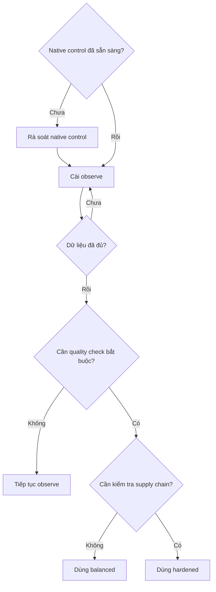

# Maintainer Defense Kit

> Kit triển khai được. Bắt đầu từ [documentation hub](../../docs/README.md).

[English](README.md) · [Tiếng Việt](README.vi.md) · [日本語](README.ja.md)

Baseline có thể cài và rollback để giảm tải review nhưng không tuyên bố phát hiện nội dung do AI tạo. Installer mặc định dry-run, không ghi đè file khác nội dung, ghi hash của từng file và có thể xác minh hoặc gỡ chính xác phần do nó tạo.

## Profile

| Profile | Quyền token | Tác động |
| --- | --- | --- |
| `observe` (mặc định) | chỉ đọc | Chỉ ghi job summary; dùng để đo tín hiệu và false positive |
| `balanced` | chỉ đọc | Làm fail quality status check có tên; không comment, gắn nhãn, close hay lock |
| `hardened` | chỉ đọc | `balanced` cộng dependency review và phân tích tĩnh workflow |

Mọi profile đều cài issue form, PR template, policy, playbook, đặc tả nhãn và hồ sơ triển khai đầy đủ về cấu trúc bằng `en`, `vi` hoặc `ja`. Nội dung Việt/Nhật chưa được chuyên gia bảo mật/pháp lý bản ngữ review độc lập.

## Chọn profile



## Cài đặt an toàn

Yêu cầu Python 3.10+; CI kiểm tra Linux (3.10, 3.12, 3.14) và macOS (3.12). Chạy từ repository này. Lệnh đầu chỉ xem trước:

```bash
python3 scripts/install_kit.py --target /duong/dan/du-an --profile observe --language vi --repo OWNER/REPOSITORY
python3 scripts/install_kit.py --target /duong/dan/du-an --profile observe --language vi --repo OWNER/REPOSITORY --apply
python3 scripts/install_kit.py --target /duong/dan/du-an --verify
```

Thiết kế dùng `pull_request_target` có đặc quyền đã bị loại bỏ sau khi zizmor phát hiện trust boundary nguy hiểm. `balanced` dùng `pull_request` chỉ đọc và chuyển output `result` được kiểm soát thành status check `PR quality gate`. Chỉ sau khi đo đủ, maintainer mới nên đặt check này thành required bằng GitHub ruleset native. Đặc tả nhãn đi kèm chỉ dành cho triage thủ công, không phải prerequisite.

## Rollback

```bash
python3 scripts/install_kit.py --target /duong/dan/du-an --uninstall
```

Uninstall chỉ xóa file installer đã tạo và từ chối nếu file đó đã bị sửa. Installer không gọi GitHub API, tạo nhãn, đổi setting hay commit code. Action được ghim bằng commit SHA và theo dõi trong [`pins.json`](../../pins.json).

Đây là baseline đã được test kỹ thuật, không phải chứng nhận bảo mật. Đọc [hợp đồng signal PR](../../docs/PROFILE_SIGNALS.md) và [hồ sơ đảm bảo](../../docs/vi/KIT_ASSURANCE.md) để biết chính xác phần đã đảm bảo và phần chưa có bằng chứng thực địa.
